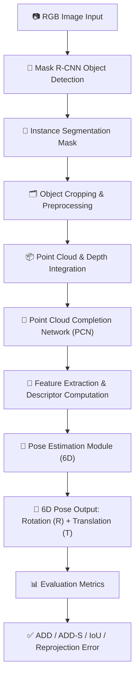

# 🛠️ 6D Object Pose Estimation Thesis Project

> Exploring robust 6D object pose estimation, grasping, and point cloud completion using deep learning, 3D vision, and advanced robotics techniques.

---

## 📖 Project Overview

The goal of this project is to **accurately estimate the 6D pose of objects** in cluttered environments using RGB-D sensors and deep learning methods. This includes:

- **Object detection & instance segmentation** (Mask R-CNN, ConvPoseCNN)
- **Point cloud extraction & completion** (PCN – Point Completion Network)
- **Pose estimation & grasp planning** for robotic manipulation
- **Simulation & validation** using tools like V-REP / CoppeliaSim

The thesis explores **2D planar grasping** and **full 3D pose estimation**, bridging **computer vision**, **robotics**, and **AI-based grasping strategies**.

---

## 🎯 Vision & Goals

- Develop a **robust pipeline** for 6D object pose estimation from RGB-D images.
- Enable **accurate grasp planning** for robotic arms in real-world environments.
- Use **deep learning architectures** (Mask R-CNN, ConvPoseCNN, PCN) for perception tasks.
- Provide **scalable and reusable datasets** for training and testing future robotics systems.
- Integrate with **simulation environments** for experimental validation.

---

## 🔄 Pipeline

---

## 🏗️ Current Progress

### 1️⃣ Instance Segmentation

- Mask R-CNN applied on RGB images to detect objects and extract instance masks.
- Handles multiple object categories and overlapping objects using group IDs.
- Output: Bounding box, mask, object category.

### 2️⃣ Point Cloud Generation

- RGB + depth image + object mask → generate partial object point cloud.
- Noise removal using **radius outlier removal** (Open3D).
- Align depth maps to RGB images for consistent 3D coordinates.

### 3️⃣ Pose Estimation & Grasping

- PCA (Principal Component Analysis) on object point cloud → rotation & orientation.
- Center position → grasp center; second principal component → close direction.
- Grasp configuration: **approach vector**, **close vector**, **jaw center**.

### 4️⃣ Point Cloud Completion

- **PCN (Point Completion Network)** used to generate full object shapes from partial scans.
- Works on both **synthetic datasets (ShapeNet)** and **real datasets (KITTI)**.
- Folding-based decoder upsamples coarse predictions → fine-grained point clouds.

---

## ⚠️ Problems & Challenges

- **Noisy instance segmentation** → requires robust point cloud denoising.
- **Incomplete point clouds** → some objects partially occluded; PCN helps but not perfect.
- **Limited real-world datasets** → synthetic datasets do not fully cover real-world variations.
- **Pose ambiguity in planar grasping** → rotational symmetry of objects can mislead PCA.
- **Math equations & transformations** sometimes lost in documentation → careful review needed.

---

## 🚀 Future Work & Next Steps

1. **Integrate full 6D pose estimation** into a real robotic grasping pipeline.
2. **Improve dataset coverage** by adding real-world scans with multiple object categories.
3. **Optimize network architectures** for real-time inference (ConvPoseCNN, PCN enhancements).
4. **Extend grasping strategies** to 3D manipulation beyond planar grasping.
5. **Automate pipeline**: from detection → point cloud → pose → grasp → simulation.
6. **Documentation & reproducibility**: Clean, structured markdown, datasets, and scripts.

---

## 📅 Milestones

| Milestone                    | Status       | Notes                                       |
| ---------------------------- | ------------ | ------------------------------------------- |
| Instance Segmentation        | ✅ Completed | Mask R-CNN trained on 28 objects            |
| Point Cloud Generation       | ✅ Completed | Partial point clouds extracted and denoised |
| Pose Estimation (2D planar)  | ✅ Completed | PCA-based angle & center estimation         |
| Point Cloud Completion (PCN) | ✅ Completed | Synthetic + KITTI dataset evaluation        |
| Grasp Planning               | ⚠️ Ongoing   | Needs full integration and testing          |
| Real-world Validation        | ⚠️ Pending   | Hardware setup required                     |
| Documentation & Reporting    | ⚠️ Ongoing   | This README + understanding.md              |

---

## 🔧 Tech Stack & Tools

- **Programming Languages:** Python 3.11+, OpenCV, NumPy, PyTorch, TensorFlow
- **Deep Learning Models:** Mask R-CNN, ConvPoseCNN, Point Completion Network (PCN)
- **Libraries:** Open3D, Matplotlib, Pandas, scikit-learn
- **Simulation Tools:** V-REP / CoppeliaSim
- **Data Management:** ShapeNet, KITTI, YCB dataset
- **File Types:** .docx, .pdf, .pptx, .zip, .png, .jpg

---

## 🗝️ Technologies

6D object pose estimation, 2D planar grasp, Mask R-CNN, ConvPoseCNN, Point Completion Network, PCN, point cloud denoising, RGB-D object detection, grasp planning, robotic manipulation, deep learning for robotics, Open3D, ShapeNet, KITTI dataset, PCA pose estimation, robotic simulation, V-REP, CoppeliaSim, RGB-D perception, synthetic point cloud dataset, object segmentation, pose estimation research

---

## 📌 Notes & References

- Always check **point cloud alignment** between RGB and depth maps.
- PCA-based orientation may fail on **symmetric objects**.
- PCN works best for **single-view partial point clouds**, consider **multi-view fusion** for better completion.
- Simulation experiments in V-REP help validate grasp strategies before real hardware deployment.
- All datasets and scripts should be **version-controlled** for reproducibility.

---

> This project combines **advanced computer vision, deep learning, and robotics** to provide an end-to-end pipeline for object detection, 6D pose estimation, point cloud completion, and grasp planning.
