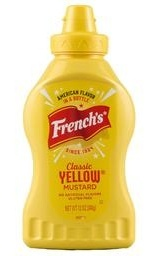
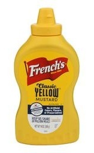
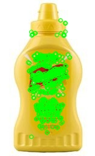
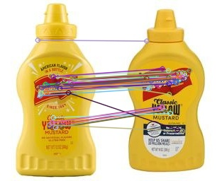
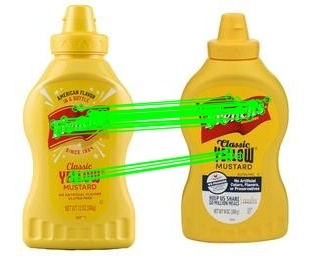
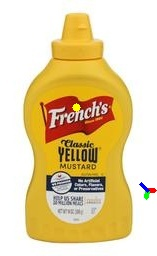
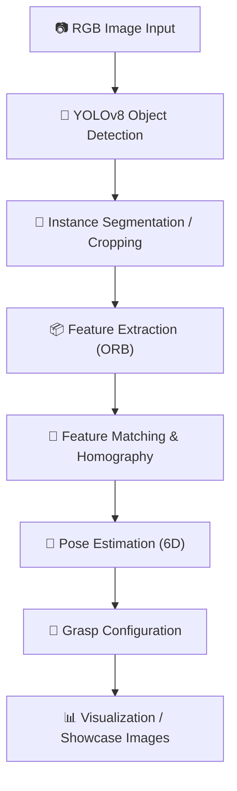

# 🛠️ 6D Object Pose Estimation Thesis Project

> Explore **robust 6D object pose estimation**, **planar grasping**, and **point cloud processing** using RGB images, classical computer vision, and deep learning. Enables accurate **pose recovery** and **grasp configuration generation** for robotic manipulation using only RGB datasets.

---

## 📖 Project Overview

This project demonstrates a **lightweight and accessible pipeline** for estimating the **6D pose (position + orientation) of planar objects** from standard RGB images. It avoids expensive sensors (like depth cameras) and works with free web datasets.

Key highlights:

- Automated **dataset preprocessing** ensures uniform size, color, and aspect ratio.
- **YOLOv8** object detection isolates the object and crops it.
- **ORB keypoints** are extracted and matched across images.
- **Homography estimation** recovers planar transformations.
- **6D pose recovery** identifies the physically valid rotation and translation.
- Generates **grasp configurations** (approach vector, closing vector) for robotic arms.

This is foundational for:

- **Robotic grasping** and object manipulation
- **Augmented reality (AR)** object alignment
- **Industrial inspection** of planar objects

---

## 🖼️ Showcase Images

### 1️⃣ Raw Image



### 2️⃣ Preprocessed / Cropped Image



### 3️⃣ Keypoints Visualization



### 4️⃣ Feature Matches



### 5️⃣ Homography Estimation



### 6️⃣ 6D Pose Axes

")

### 7️⃣ Grasp Configuration



> These images illustrate **every stage of the pipeline**, from raw image to pose recovery and grasp visualization.

---

## 📂 Project Structure

```
6D_Object_Pose_Estimation/
│
├─ .venv/ # Python virtual environment
├─ data/
│ ├─ raw_images/
│ │ └─ Frenchs_yellow_mayonnaise_bottle/
│ ├─ processed_images/
│ │ └─ Frenchs_yellow_mayonnaise_bottle/
│ ├─ detections/
│ │ └─ Frenchs_yellow_mayonnaise_bottle/
│ │ ├─ cropped/
│ │ └─ bboxes.json
│ ├─ features/
│ │ ├─ keypoints/
│ │ ├─ matches/
│ │ ├─ homography/
│ │ ├─ pose/
│ │ └─ grasp/
│ └─ models/ # Optional 3D object models
│
├─ showcase_pictures/ # Images for README / portfolio
├─ 01_download_images.py
├─ 02_preprocessing.py
├─ 03_object_detection_yolo.py
├─ 04_keypoints.py
├─ 05_feature_matching.py
├─ 06_estimate_homography.py
├─ 07_pose_from_homography.py
├─ 08_visualize_pose.py
├─ 09_compute_grasp.py
├─ requirements.txt
├─ README.md
└─ understanding.md # Notes & methodology
```

---

## ⚙️ Dependencies

- Python >= 3.10
- [OpenCV](https://opencv.org)
- [NumPy](https://numpy.org)
- [Matplotlib](https://matplotlib.org)
- [Ultralytics YOLOv8](https://docs.ultralytics.com)
- [Pillow](https://python-pillow.org)

Install via:

```
pip install -r requirements.txt
```

---

## 🛠 Pipeline Workflow (Steps 01–09)

1. **Download Images** – Automated download of target object images.
2. **Preprocessing** – Resize, crop, RGB conversion, and padding.
3. **Object Detection (YOLOv8)** – Detect object and save bounding boxes.
4. **Feature Extraction (ORB)** – Extract keypoints and descriptors.
5. **Feature Matching** – Find correspondences between image pairs.
6. **Homography Estimation** – Compute planar transformation.
7. **Pose Estimation** – Decompose homography into 4 candidate 6D poses; select physically valid pose.
8. **Visualization** – Draw axes on image to illustrate pose.
9. **Grasp Planning** – Generate approach vector, closing direction, and grasp center.

---

## 📈 Results

- **Images processed:** 44
- **Object detection:** Successful for most images
- **ORB keypoints:** Extracted & visualized
- **Feature matches:** Hundreds of correspondences per pair
- **6D pose recovery:** Valid rotation & translation
- **Grasp configuration:** Approach & close vectors calculated

✅ Fully works with **RGB images only** , without depth sensors.

---

## 🔄 Pipeline Flow (Visual)



---

## 💡 Use Cases

- Lightweight **6D pose estimation** for robots, AR, and industrial inspection.
- Can scale from **single-object** to multi-object datasets.
- Generates **grasp-ready configurations** for robotic manipulation.
- Supports **reproducibility** using free RGB images.

---

## 🎯 Vision & Goals

- Robust **6D pose estimation** pipeline.
- Accurate **grasp planning** for robotic arms.
- Integration with **deep learning architectures** for perception.
- Provide **scalable datasets** and showcase images for research.

---

## 🗝️ Tech & Concepts

6D object pose estimation, planar grasp, ORB feature matching, homography estimation, RGB image processing, grasp planning, robotics, 3D vision, PCA, point cloud, deep learning, RGB-only pipeline, visual demonstration, showcase images.

---
